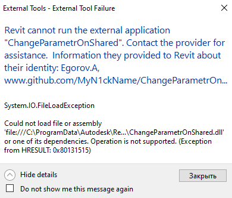

# ChangeParametrOnShared

Autodesk Revit Plug-In for replace a Family Parameter to a Shared Parameter
## Installation
* Download ChangeParametrOnShared.dll and ChangeParametrOnShared.addin
from last [Release](https://github.com/MyN1ckName/ChangeParametrOnShared/releases)
* Copy to C:\ProgramData\Autodesk\Revit\Addins\ **Your Version Revit**\
> If you see this:
> 
> 
> 
> you just need to unlock ChangeParametrOnShared.dll as [here](https://revitoped.blogspot.com/2011/07/unblock-your-app.html)
## License
This sample is licensed under the terms of the [MIT](https://opensource.org/licenses/MIT) License.